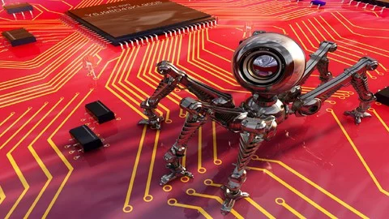

  

# Modern Computer Vision

This folder contains all the material, notes, experiments, and projects developed throughout the Udemy course focused on modern Computer Vision techniques and deep learning applications.

The purpose of this directory is to organize and document the practical implementations and theoretical knowledge acquired during the course.

---

## 🚀 What This Course Covers

Throughout this course, the following topics and skills were developed:

- Comprehensive Computer Vision theory and core concepts
- Deep Learning for Vision using PyTorch, TensorFlow 2.0 and Keras
- Object Detection frameworks including YOLOv8, R-CNNs, Detectron2, SSD, EfficientDet and more
- Advanced segmentation techniques using U-Net, SegNet, DeepLabV3 and Segment Anything
- Understanding CNN interpretability through activation visualization and GradCAM
- Generative Adversarial Networks (GANs) and Autoencoders for image generation and super resolution
- Training, fine-tuning and evaluating custom image classifiers
- Facial recognition and attribute detection (age, gender, emotion, ethnicity)
- Neural Style Transfer and Deep Dream
- Transfer Learning and advanced CNN architectures such as ResNet, InceptionV3, DenseNet, MobileNet and EfficientNet
- Tracking systems using DeepSORT
- Siamese Networks for similarity learning and face verification
- Image Captioning, Depth Estimation and Vision Transformers
- 3D data processing with Point Cloud classification and segmentation
- Building Computer Vision APIs and Web Applications using Flask
- In-depth use of OpenCV4 for practical computer vision tasks
- Working with Google Colab notebooks for reproducible experimentation
- Modern multimodal models such as Meta CLIP for enhanced image analysis
- Emerging vision models such as YOLOv8 and DINO-based architectures

---

## 🧠 Key Learning Outcomes

By completing this course, the following competencies were strengthened:

- Strong theoretical foundation in modern Computer Vision
- Practical implementation skills across multiple deep learning frameworks
- Experience with state-of-the-art detection, segmentation and generative models
- Understanding of explainability techniques for neural networks
- Ability to build production-ready Computer Vision systems and APIs
- Exposure to advanced architectures including Vision Transformers and multimodal models

---

## 🎯 Purpose of This Folder

This directory serves as:

- A structured archive of all coursework and implementations
- A personal reference for Computer Vision projects
- Practical reinforcement of advanced Deep Learning concepts
- Part of my continuous professional development in AI, Deep Learning and Computer Vision
